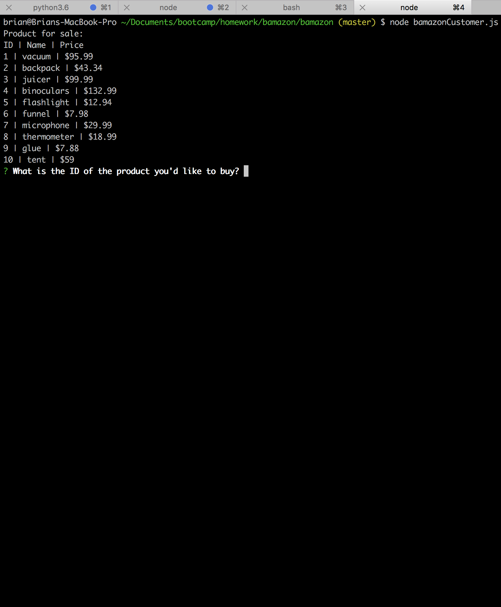
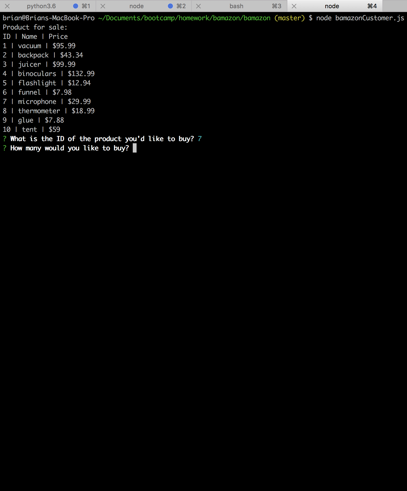

# bamazon

This is a simple node module to similuate interaction with an online store. Below are a few screenshots demonstrating how it is used.

1. Select a product from the invenvtory

2. Enter the amount you'd like to purchase

3. View the total cost of purchase
